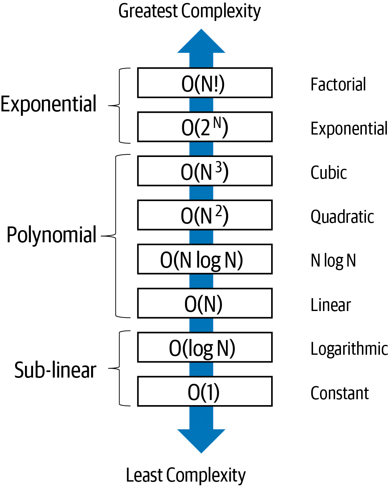

### Questions to Ask
* Am i solving a specific problem in the most efficient way?
* Am I implementing an algorithm in the most efficient way?
* Should I just use a faster computer?

# Performance Classes
Models should predict the _worst runtime performance_ for a given problem, N. AKA the _upper bound_ in mathematics.
The _lower bound_: the minimum runtime performance.

## Asymptomatic Analysis
This helps us remove the machine's performance when analyzing an algorithm's performance.
**Big O** is used in computer science to classify an algorithm's _best case_ and _worst case_.

**O**: _the order of a function_. For an algorithm with problem instance of size N, first count the number of operations.

1. Determin K(N), how many times a _key operation_ executes on a worst case problem.
2. Estimate the # of machine instructions executed as a multiple of this count: `c * K(N)`.

Example: How many times does the key operation `ct ++` execute?
```go
for i := range(100) {
	for j := range(N) {
		ct++
    }
}
```
Answer: `100 x N` times. This is `O(N)`, or `O(f(N))`. 

## Space Complexity
There is no standard unit for space. Bytes? Bits? 32-bit? etc....

## Lagarithms
Are the opposite of exponentiation.
To find `x` in `2x=33,544,432`, compute `log2(33,544,432)`, using base `2`.

Answer: `25`. Similarly `2^25 = 33,544,432.` 

If you divided `33,544,432` by `2`, it would take 25 divisions by 2 to get to 1.

Log computes a floating point result: `log2(137)` is roughly `7.098032` because `2^7 = 128`, and `137` would require a
higher exponent for base 2.

##Binary Array Search
Iternates no more than `floor(log2(N)) + 1` times.

This is `O(log N)`, the _logarithmic complexity class_, where `f(N) = log(N)`

## Complexity Classes


If an algorithm contains two substeps, we use the substep with the dominant complexity class to measure the time.