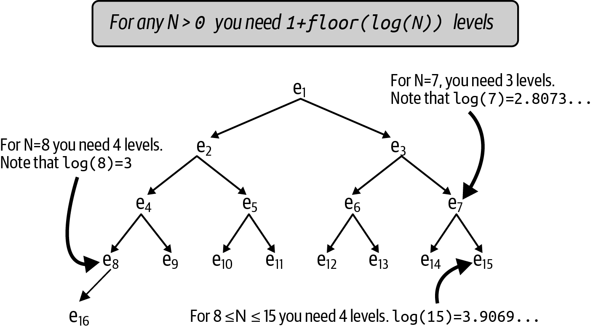
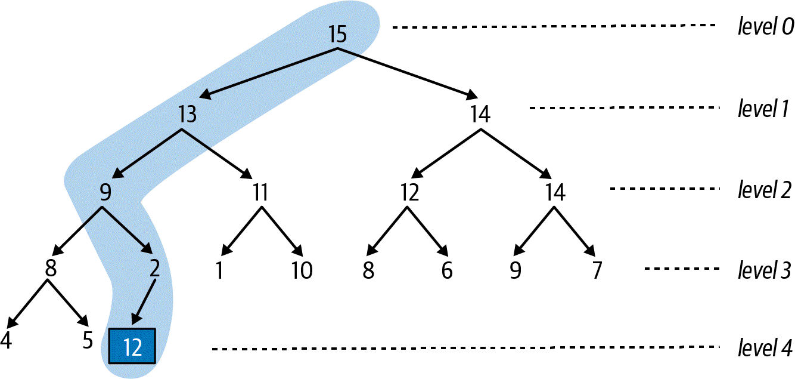
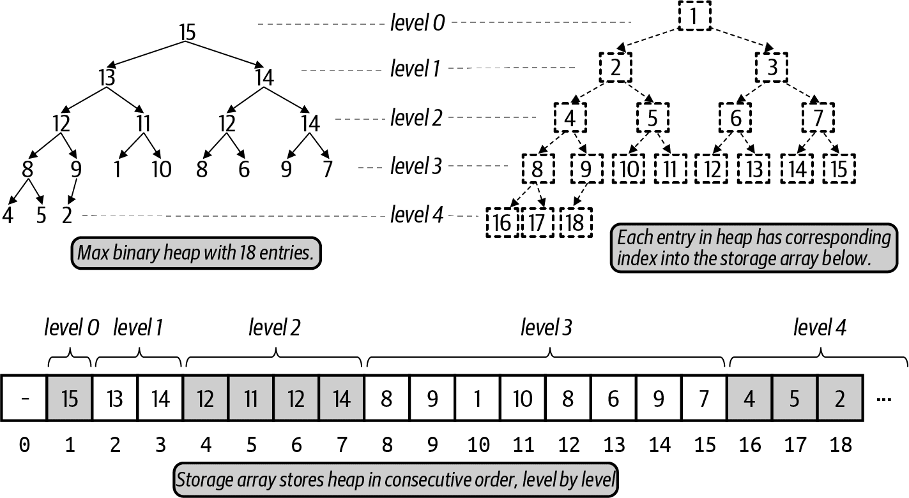

### Priority Queues
Enqueu and dequeue funcs are no longer as efficient when priority is implemented in a queue.

Enqueue is still `O(1)` if a linked list is used, but dequeue would require `O(N)` in the worst case. Unless values were
sorted by priority, then dequeu would require `O(N)`, and eneueu would require `o(N)` in the worst case.

The **Heap** data structure was invented in 1964 and provides `O(log N)` performance.
Heaps have a mximum size, `M`, and can store `N<M` entries.

## Max Binary Heaps
Max binary heaps have the following properties:
* **Heap-ordered prioperty**
  * The priority of an entry is greater than or equal to the priority of its children(if there is a right child) and the priotity for each entry is smaller than or equal to the priority of its parent entry.
* **Heap-shaped propert**
  * Evel level k must be filled with `2k`(level) entries (from left to right), before any entry appears on level k+1
#### How many levels are needed for a binary heap to store `N>0` entries?
Example:
Given 16 entries:

Notice the pattern on the left: `e1, e2, e4, e8, e16`. This indicates that `L(N) = 1+floor(log(N))`. 

### Inserting a (value, priority)
Here's a good strategy:
* Place new entry at first available empty location on last level
* If it's full, extend the heap and add a new level, placing it on the leftmost location.
To maintaing the order, we just rearrange entries that lie in the path from the newliy placed entry in the direction of 
topmost entry, "simming" up to the proper location. For example:

A worst-case situation would be if the newly enqueued entry is higher than any entry in the max binary heap: `floor(log(N))`.
So the time of an enqueu is `O(log N)`.

### Removing a value with highest priority
Effective dequeue strategy:
1. Remove rightmost entry on bottommost level, store in memory.
2. Save the highest-prioroty entry and level 0 to be returned.
3. Replace position 0 with the item removed from the bottommost level (this may break hea-ordered property.)
4. Then, "sink down" this entry to a location further down the heap to re-establish the heap-ordered property.

We sink down by determining which child has the higher priority, and moving downwards. This means the number of comparisons
doesn't exceed `2 x floor(log(N))`, so `log(N)` is the worst case.

### Representing binary heaps as an array
**NOTE**: The author doesn't use the `0` storage location to simplify the formula for calculations. Not sure about how 
"proper" this is. I should update the calculationg later to include the index `0` position as well. (See Advanced Agorithms book).

_To find the child location_:
An entry in `storage[k]` with a left child, that child will be foundin `2*k`. For a right child, it is `2*k+1`.
_To find the parent location_:
If k > 1, the parent is found at `k / 2`. 
For example, see dashed boxes in image above. The entry at `storage[k]` will have no child if `2 x k > n`.

