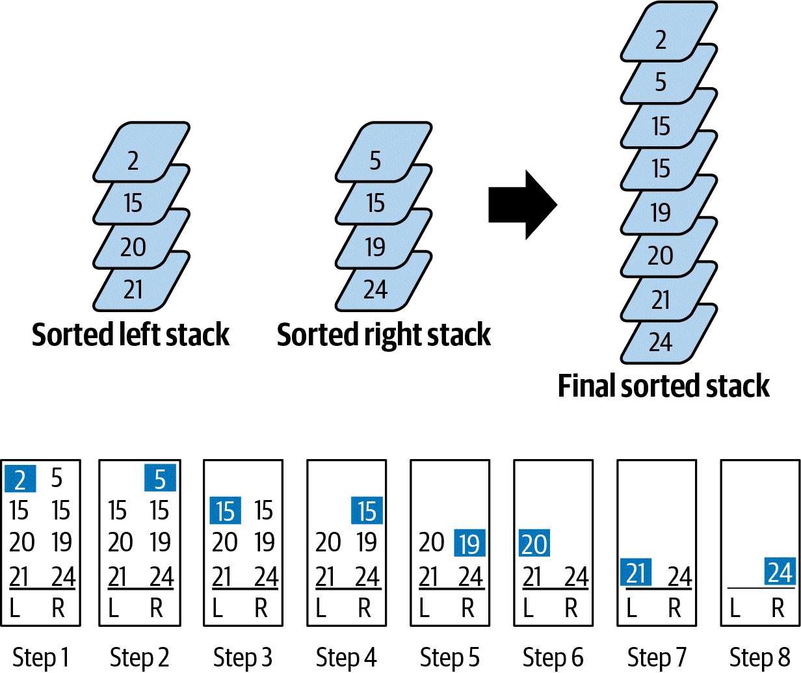

# Selection

## Selection Sort
Incrementally sorts an array from left to right. It selects the smallest value remaining and swaps it into place.
It will take `N - 1` swaps to sort the array. It has performance of `O(N2)`.

## Insertion Sort
Also takes  N - 1` swaps. It assumes `a[0]` is already in the correct position, checks if `a[1]` is smaller, swapping if
needed. It then inserts `a[2]` into the proper sorted location, giving it three possibilities. This means that the values
will need to be repeatedly swapped.  
The number of comparisons will always be greater than or equal to the number of comparisons.

## Analyzing Insertion Sort and Selection Sort Performance
Both are quadratic, giving `O(N^2)` performance.  
Insertion sort should outperform selection sort, on average.  
The worse case for insertion sort is when the values appear in descending order, making the number of comparisons/swaps
`1/2 * N2 - 1/2`.

## Recursion and Divide and Conquer
**Fibonacci series**: Starts with 0, 1, 2. Next integer is the sum of the two prior numbers. Ex: 0, 1, 2, 3, 5, 8, 13...  
Recursively, this is: `F(n) = F(n-1) + F(n-2)`.

The **Factorial** of a number `N` are the product of all positive integers less than or equal to N. Written as `N!`. Ex:
`5! = 5 x 4 x 3 x 2 x 1 = 120`.  
This can also be represented as `N! = N x (N - 1)!`. example: `120 = 5x 4 !`.

### Merge Sort
An in-place recursive algorithm. Requires extra storage, but gives `O(N log N` speed. It divides a given array in two,
and merges them _in place_. Visual example:
  
First allocate the required extra storage to place the values, for efficiency.