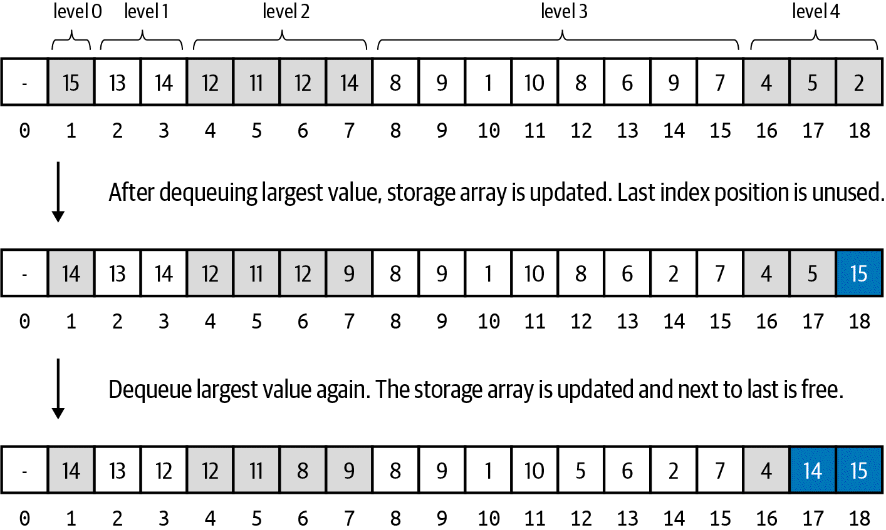

# Selection

## Selection Sort
Incrementally sorts an array from left to right. It selects the smallest value remaining and swaps it into place.
It will take `N - 1` swaps to sort the array. It has performance of `O(N2)`.

## Insertion Sort
Also takes  N - 1` swaps. It assumes `a[0]` is already in the correct position, checks if `a[1]` is smaller, swapping if
needed. It then inserts `a[2]` into the proper sorted location, giving it three possibilities. This means that the values
will need to be repeatedly swapped.  
The number of comparisons will always be greater than or equal to the number of comparisons.

## Analyzing Insertion Sort and Selection Sort Performance
Both are quadratic, giving `O(N^2)` performance.  
Insertion sort should outperform selection sort, on average.  
The worse case for insertion sort is when the values appear in descending order, making the number of comparisons/swaps
`1/2 * N2 - 1/2`.

## Recursion and Divide and Conquer
**Fibonacci series**: Starts with 0, 1, 2. Next integer is the sum of the two prior numbers. Ex: 0, 1, 2, 3, 5, 8, 13...  
Recursively, this is: `F(n) = F(n-1) + F(n-2)`.

The **Factorial** of a number `N` are the product of all positive integers less than or equal to N. Written as `N!`. Ex:
`5! = 5 x 4 x 3 x 2 x 1 = 120`.  
This can also be represented as `N! = N x (N - 1)!`. example: `120 = 5x 4 !`.

### Merge Sort
An in-place recursive algorithm. Requires extra storage, but gives `O(N log N` speed. It divides a given array in two,
and merges them _in place_. Visual example:
  
First allocate the required extra storage to place the values, for efficiency.

### Quicksort
Recusively sorts an array by using a element in the array as a pivot value `p`, and inserts `p` into its proper location
in the sorted array. It rearranges the array's contents so there is a sub array with the values that are `<= p`, and a right
subarray with values that are `>= p`.  
It depends on a partitioning function.. If the array given to quicksort is already sorted, the performance
degrades to `O(N2)`. It's a common practice to use a random number to get the pivot index value.

### Heap Sort
Why is a heap sort useful to sort an array? When the max value is dequeued, the last index position is now unused, and 
that's the index position that should contain the max value of the sorted array, so the dequeued value can be placed there.  

Our heap implementations in this book don't use the 0 index position (to simplify the computations, remember?), Also, the heap
is initially empty, so we need a way to "bulk upload" all the values instead of one by one.
To address this, in our implementation, the `less(i,j)` and `swap(i,j)` functions will subtract 1 from i and j, when accessing
`a[i]` or `a[j]`, allowing us 1-based indexing to work with 0-based storage.
