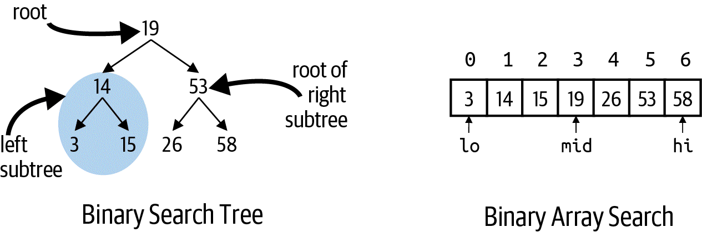
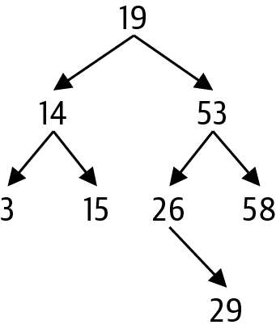
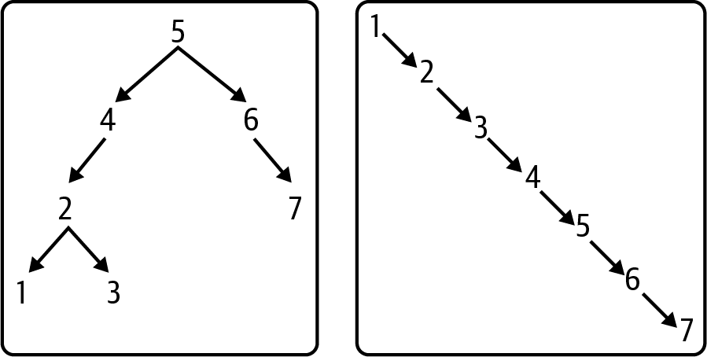
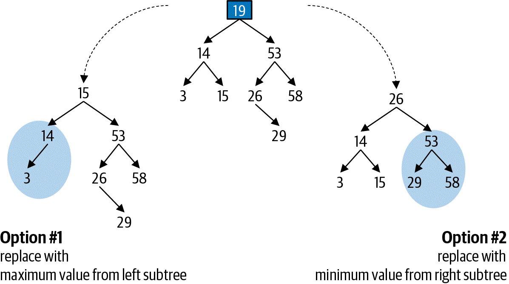
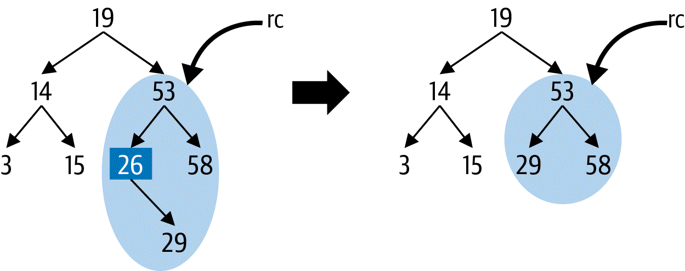

# Binary Trees
Binary trees are _recursive_ data structures, as they refer to other binary tree structures within

## Binary Search Tree
Store collections of values with efficient search, insert, and remove operations.  
They help solve challenges introduced by large fixed arrays.  
A binary search tree placed side by side with a sorted array with the same values:

This exemplifies two global constraints of binary search trees:
* If node _n_, has a left subtree, all values in the subtree as <= _n_
* If node _n_, has a right subtree, all values in the subtree are >= _n_

A _leaf_ is a node without any subtrees. As such, computer-science tress can be considered to be upside down.  
_Parents_ and _descendants_ are other words used to describe tress.

The order in which an array's values are inserted into the binary tree determines the tree's structure. For example,
inserting 29 into the above tree will result in the following:

The worse case scenario for a binary search tree is revealed when all values are inserted in increasing order:

### Removing values from a Binary Search Tree
Removing values from binary search trees is trickier than a linked list. What if the value is the current root node?
The figure below demonstrates the two possible outcomes:

* Option 1: Find & remove maximum value in the left subtree, use it for new root
* Option 2: Find & remove minimum value in the right subtree, use it for new root

We'll use option 2, here, demonstrated below:

This brings rise to the **subproblem** of removing the min value in a given subtree. **the minimum value in a subtree cannot
have a left child**, otherwise it wouldn't be the smalled value.  
We implement this with our `_remove_min` function.

### Traversing a Binary Tree
_Traversal_ is when we return the values of a binary tree in ascending order.
We can't use the same approach as in liked lists, because we have both right and left references to follow.

## Analyzing Performance of Binary Search Trees
The height of a tree determines the speed of search, insert, and remove operations. _Height_ of a node is the number of 
left/right references needed to get to the most distant descendant leaf node (a leaf node has a height of 0).  
`-1` is used to signify the height of a nonexistent binary node.

In the worse case, the number of nodes traversed in a search operation is based on the height of the tree.

Generally, the runtime performance of insert and search is `O(h`, where `h` = height of the tree.  
Removing a node takes three steps:
1. Locate the node with the value to be removed
2. Locate the minimum value in the node's right subtree
3. Remove the value from the right of the subtree

In the worst case, removal is `3xh`, but it is also generally `O(h)` 

As mentioned earlier, a binary search tree's structure is dependent on the order that the values are inserted/removed.
This means we need a strategy for the tree to determin when it is performing poorly.

## Self-Balancing Binary Trees
AVL trees guarantee that height differences of any node(height of the node's left subtree minus height of the node's right
subtree) is -1, 0, or 1.
Each node stores its height, and inserting a node means the nodes of the affected nodes are computed to ensure that an
unbalanced tree is detected immediately.

